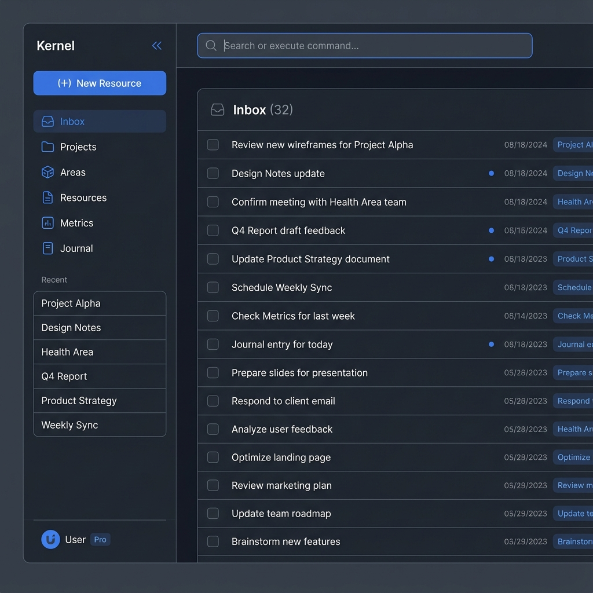
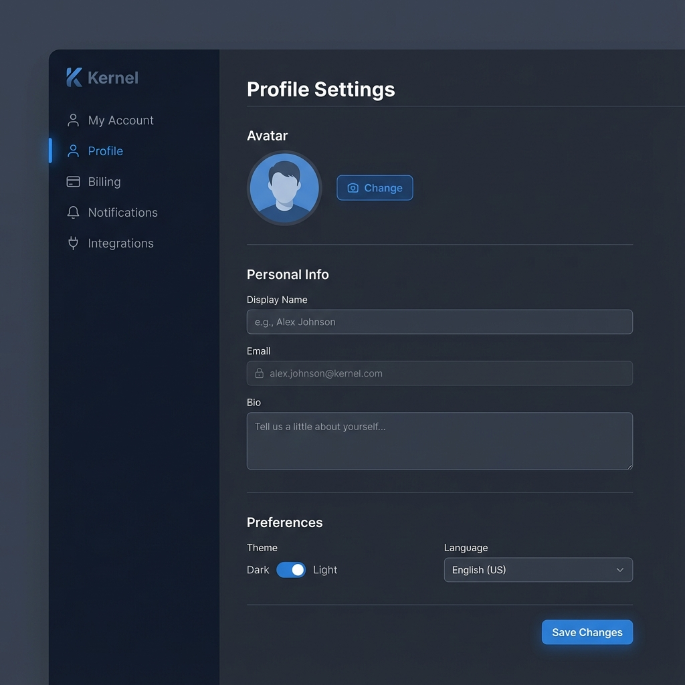
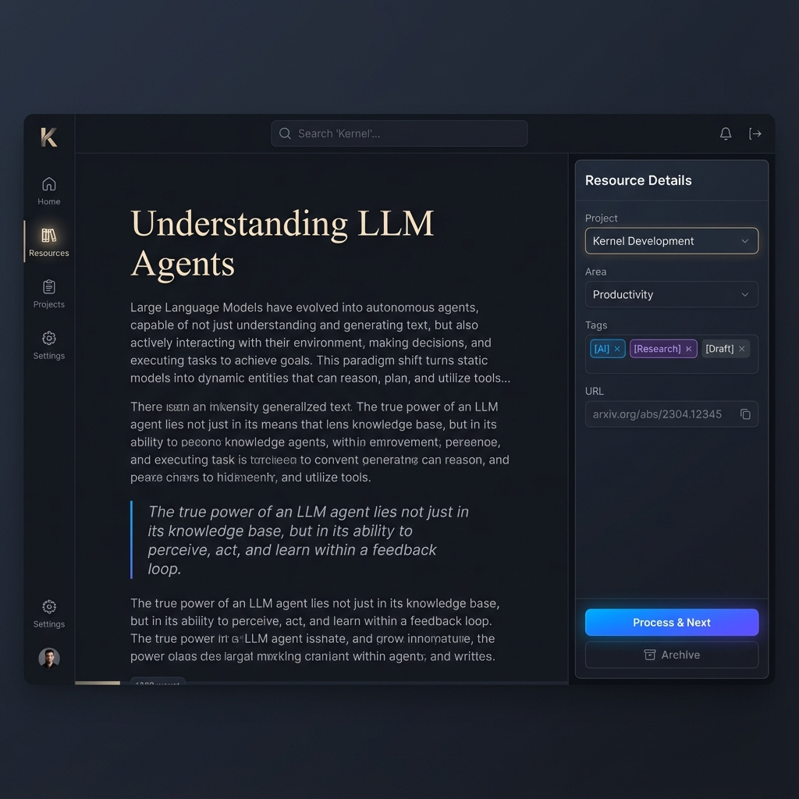
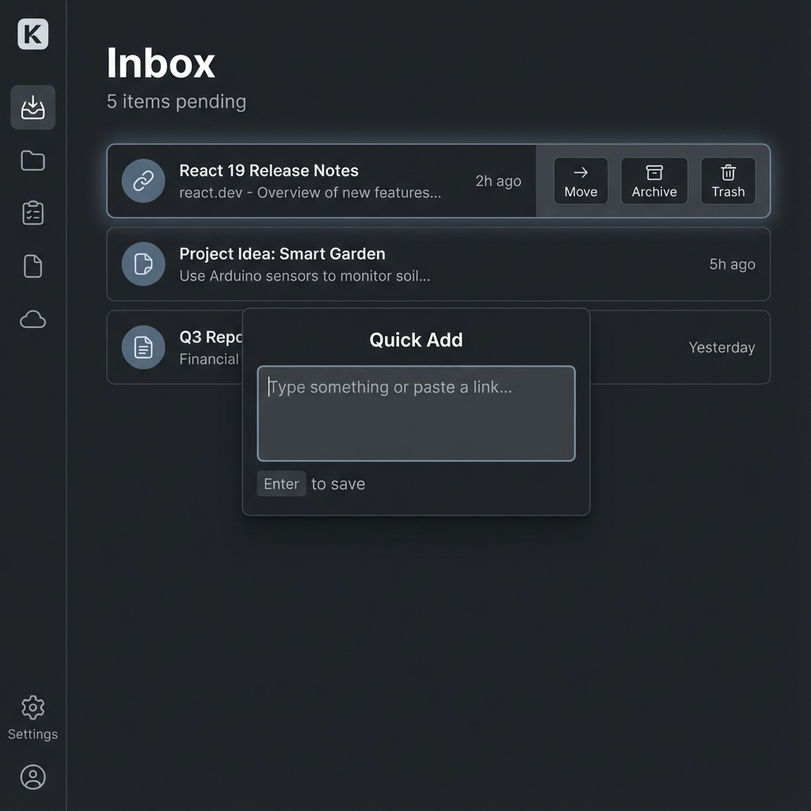
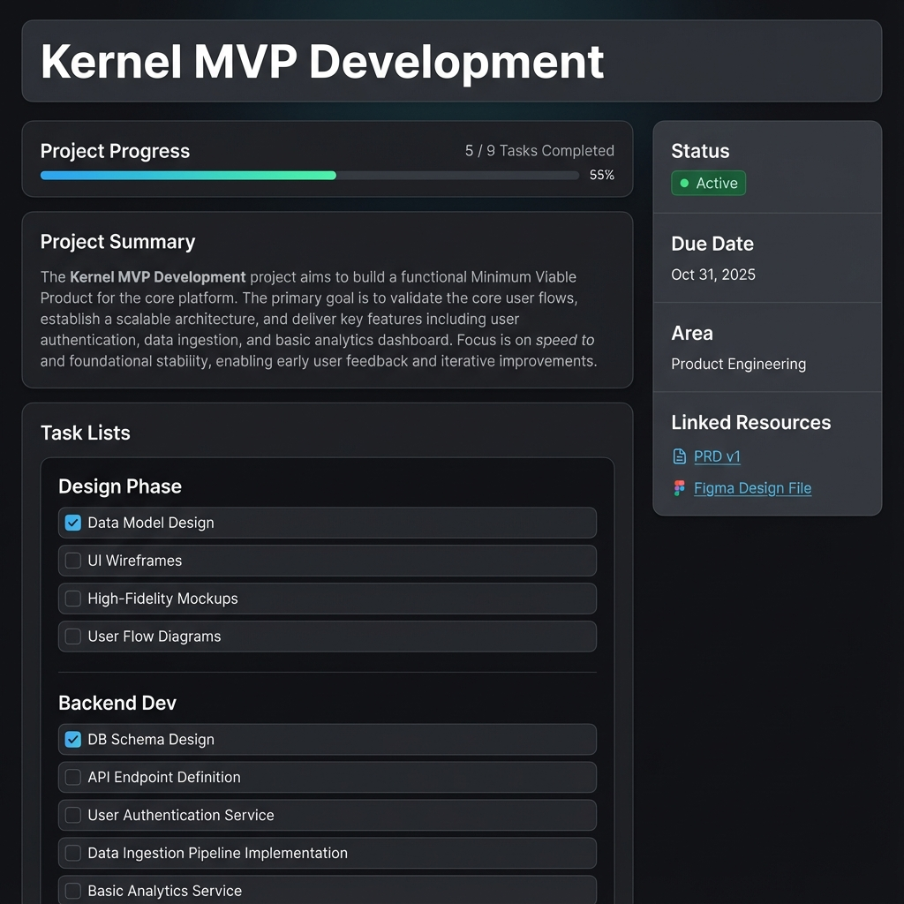
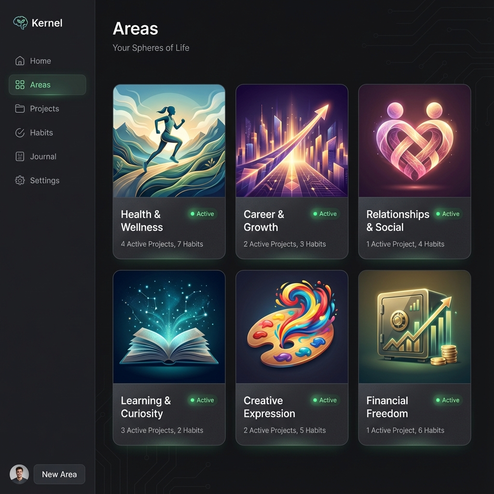
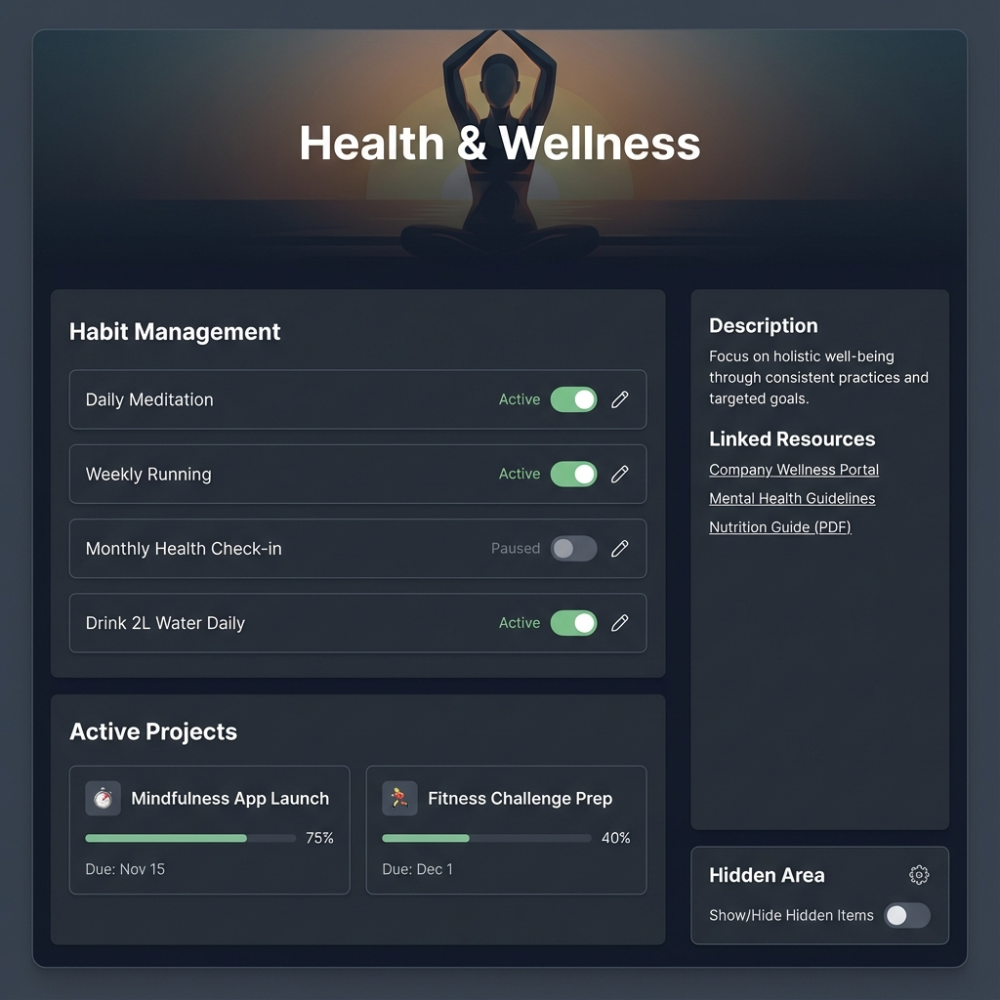

# **Product Requirement Document (PRD): Kernel**

**Version**: 2.1  **Language**: Traditional Chinese (繁體中文) **Status**: Planning

---

# **1. 產品概述 (Product Overview)**

## **1.1 產品願景 (Vision)**

**Kernel** 是一款專為高效能知識工作者設計，整合資訊管理、目標執行與量化追蹤的個人效能系統。它旨在解決現代人資訊焦慮、執行力不足與生活缺乏反思的問題。透過整合 PARA 方法論、原子習慣 (Atomic Habits) 與量化自我 (Quantified Self) 概念，打造一個從「快速捕捉」到「深度執行」再到「系統回顧」，形成一個可持續運作的個人系統。

> 這不是另一個「更強大的筆記工具」，而是一個**讓個人知識管理、建立習慣、目標執行與自我觀察能夠可持續運作的完整系統**。
> 

## **1.2 目標用戶 (Target Audience)**

- **軟體工程師/開發者**: 需要管理多個 side projects、學習新技術棧、並保持深度工作狀態。
- **創意工作者/PM**: 需要捕捉大量靈感，並將其轉化為可執行的專案。
- **自我成長追求者**: 熱衷於數據化生活、習慣養成與日記反思。

## **1.3 核心概念與產品詞彙定義**

### 資源（Resource）

用於表示**一筆可被保存、引用與回溯的內容單位**，如文章、筆記、外部參考連結、會議重點或任何具有資訊價值的內容。

Resource 為**獨立存在的資訊實體**，不以資料夾、分類或實體檔案形式管理，而是透過與專案（Projects）與領域（Areas）的關聯，建立其存在脈絡與使用情境。

每一筆資源皆具備明確的狀態，用以反映其是否已完成決策與是否仍屬於當前關注重心。

資源可乘載以下內容：

- 標題
- 資源內容 (Content)
- 參考連結 (URL)
- 關聯專案
- 關聯領域
- 標籤
- 資源狀態 - 資源具備以下三種狀態：
    - **Pending**
        
        表示該資源尚未完成決策，尚未被歸屬至任何專案或領域。
        
        Pending 狀態之資源僅存在於 Inbox，用以承載尚待處理的內容。
        
    - **Processed**
        
        表示該資源已完成決策，並已至少關聯一個進行中專案（Project）或啟用中領域（Area），
        
        因而具備明確的使用脈絡，並可出現在資源庫中供後續查詢與使用。
        
    - **Archived**
        
        表示該資源已退出當前關注重心，
        
        不再具備任何有效的進行中專案或啟用中領域關聯。
        
        Archived 資源預設不顯示於資源庫列表，但仍可透過搜尋與篩選進行回溯。
        

---

### 收件匣（Inbox）

用於承載尚未完成決策的資源（Resources）之暫存視圖。

Inbox 並非獨立資料實體，而是所有 status = Pending 之 Resource 的集合視角，用以集中處理尚未被歸屬至任何專案（Project）或領域（Area）的內容。

Inbox 的設計目的在於促進決策與分流，而非作為長期存放或分類空間。

所有進入 Inbox 的資源，皆必須經由以下其中一種行為被處理：

- 分流至至少一個專案（Project）或領域（Area），並將狀態轉為 Processed
- 封存（Archived），表示暫時不納入當前關注重心
- 移除（Delete），表示不再保留該資源

系統不允許資源在未建立任何關聯的情況下，直接由 Pending 轉為 Processed，以避免形成無上下文之資源堆積。

---

### 資源庫（Resource Library）

用於**陳列、瀏覽與查詢已完成決策之資源（Resources）**的聚合視圖。

資源庫包含所有狀態為 Processed 與 Archived 之資源，

並作為使用者回溯、搜尋與再利用資源的主要入口。

資源庫本身並非實體儲存位置，而是一個依據資源狀態所組成的聚合視圖（Aggregated View）。

資源是否顯示於資源庫，取決於其當前狀態：

- 狀態為 Pending 之資源，代表尚未完成決策，僅存在於 Inbox，不顯示於資源庫
- 狀態為 Processed 之資源，代表具備有效關聯脈絡，預設顯示於資源庫
- 狀態為 Archived 之資源，代表已退出當前關注重心，預設不顯示於資源庫列表，但可透過搜尋或篩選條件被查詢與回溯

資源庫的設計目的在於提供一個低噪音、可回溯的資源查詢空間，而非暫存或待處理區域。

---

### 專案（Project）

用於管理具備明確目標、可被完成之工作單位。

Project 代表一段需要被推進並做出明確決策結果的行動歷程，其存在目的在於將目標拆解為可執行的任務（Tasks），並追蹤行動的完成與中止結果。

每一個專案皆必須關聯至少一個領域（Area），

以確保其行動具有明確的長期責任脈絡，而非獨立存在的工作片段。

專案可承載以下內容：

- 專案名稱
- 任務（Tasks）與任務清單（Task Lists）
- 專案進度（依任務完成情況計算）
- 專案摘要與說明
- 隸屬領域 (Area) (非必要)
- 相關資源（Resources）之關聯
- 截止日期
- 專案狀態 - 專案具備明確且有限的狀態，用以反映其行動推進與決策結果：
    - Active（進行中）：專案目前仍在推進，尚未達成其完成條件
    - Completed（已完成）：專案目標已達成，行動層級正式結束，為終態狀態
    - Archived（封存）：專案在未完成的情況下被中止或擱置，代表一個未完成但已被放下的決定
        
        專案僅允許以下狀態轉換：
        
        - Active → Completed （達成目標）
        - Active → Archived （中止 / 擱置）
        - Archived → Active （重啟專案）

---

### 任務（Tasks）

用於描述專案（Project）中可執行、可完成的具體行動單位。

Task 隸屬於單一專案（Project），並用以拆解專案目標、追蹤執行進度與完成狀態。

任務本身不承載長期狀態或知識內容，而僅代表「是否已完成」的執行結果。

任務可依需求被組織於多個任務清單（Task Lists）之下，以反映不同階段或工作流程，但所有任務皆服務於其所屬專案之完成。

任務完成情況將用於計算與呈現專案進度，惟不影響資源（Resource）、日記（Journal）或指標（Metrics）之狀態。

---

### 領域（Area）

用於描述長期存在、無明確結束時間的人生責任範圍或生活面向。

Area 並非用於管理任務或推進目標，而是作為專案（Projects）與習慣（Habits）的結構性背景，

用以界定使用者在不同人生面向中所承擔的持續責任。

領域本身不具備完成狀態，

其狀態僅反映該責任範圍目前是否仍屬於使用者的關注視野。

領域可承載與影響以下內容：

- 長期維持行為之習慣（Habits）
- 隸屬於該領域之專案（Projects）
- 與該領域相關之資源（Resources）關聯
- 領域狀態 - 領域僅具備以下兩種狀態：
    - Active（啟用中）：該領域仍屬於當前關注的人生版圖
    - Hidden（隱藏）：該領域暫時退出關注視野，但不代表其重要性被否定
    
    領域不具備完成或封存之語意，狀態僅代表注意力的退場，而非責任的結束。
    

---

### 習慣（Habits）

用於描述為維持某一領域（Area）而需持續重複進行的行為承諾。

Habit 隸屬於單一領域（Area），並以每日是否執行為主要記錄方式。

習慣不以完成為目標，亦不具備結束條件，其存在目的在於支持長期狀態的維持，而非推進特定成果。

在日記（Journal）中，習慣以每日勾選清單（Checklist）形式呈現，用於記錄該行為於當日是否發生，而不進行評價、累積成就或連續性計算。

習慣之勾選僅代表行為發生與否，不直接影響指標（Metrics）數值，亦不轉化為任務或資源。

---

### 封存（Archive）

本產品中不存在傳統意義上的檔案封存機制。

封存代表資源（Resource）狀態轉換為 Archived，用以表示該資源不再屬於當前關注重心，但仍可被搜尋與回溯，且不影響資料完整性。

---

### 日記（Journal）

用於記錄**每日狀態與觀察結果的時間型容器**。

Journal 本身不承載長期結構或核心資料，

而是以「日期」為索引，彙整並呈現該日所對應的行為、狀態與觀察紀錄。

在 Journal 中，使用者可進行以下紀錄行為：

- 勾選當日習慣（Habits）之執行情況
- 填寫指標（Metrics）之當日數值
- 檢視當日仍在進行中的專案（Projects）
- 檢視中尚未分流或封存決策之資源 (Pending Resources)
- 撰寫當日的文字記錄與摘要

Journal 不負責建立、管理或評價專案、習慣與指標本身，僅作為這些結構在特定日期下的**使用與觀察介面**。

Journal 的設計目的在於提供一個低干擾、可回溯的每日視角，協助使用者理解狀態的變化，而非追求效率、連續性或績效評分。

---

### 指標（Metrics）

由使用者定義的「需被長期觀察與量化的狀態」。

Metrics 為獨立存在的觀測項目，可於 Journal 中被重複量測，並用於分析趨勢、關聯性與長期變化。

---

## ~~1.4 用戶旅程 (User Journey)~~

# 2. 非功能性需求 (**Non-Functional Requirements)**

## 2.1 多語系支援 (i18n)

系統未來可支援多語系擴展，開發階段首先支援繁體中文

## **2.2 保密性 (Confidentiality)**

敏感數據（如密碼、支付資訊）必須經過加密（例如 256-bit AES），在傳輸和儲存時都不能被未經授權者讀取。

## **2.3 完整性 (Integrity)**

防止數據在儲存或傳輸過程中被惡意篡改或意外損壞。

## **2.4 授權與訪問控制 (Authorization & Access Control)**

基於用戶角色和權限，限制對特定數據和功能的訪問。

## **2.5防護與防禦 (Protection & Defense)**

抵禦各種網路攻擊，如 DDoS、SQL 注入、跨站腳本（XSS）等。

## **2.6 合規性 (Compliance)**

遵守相關的數據保護法規（如 GDPR, CCPA）。

## **2.7 事件日誌與監控 (Logging & Monitoring)**

記錄所有安全相關事件及重要操作，以便追溯和調查。

# **3. 功能詳細規格 (Detailed Functional Specs)**

## 3.0 全站畫面布局 (Layout)

### 說明
系統採用 **左側導航 (Sidebar) + 頂部工具列 (Top Bar) + 主要內容區 (Main Content)** 的經典佈局，確保操作效率與資訊呈現的最大化。

### 布局

*   **左側導航欄 (Sidebar)**:
    *   **頂部**: App名稱 (Kernel) 及 收折 Sidebar 按紐。
    *   **快速捕捉按鈕**: `(+) New Resource`，隨時開啟 Capture Modal 紀錄想法。
    *   **核心導航**: Inbox, Projects, Areas, Resources, Metrics, Journal。
    *   **近期開啟 (Recent)**: 顯示近期開啟的六個資源/專案/領域。
    *   **底部**: 會員資訊摘要 (頭像、名稱、方案)。

*   **頂部工具列 (Top Bar)**:
    *   **全域搜尋 (Global Search)** (middle): 快速查找資源、專案、領域 (Command Palette 形式)。

*   **主要內容區 (Main Content)**:
    *   顯示各功能模組的核心內容，支援響應式設計。

### 行為

*   **App 名稱**: 點擊可回到首頁 (預設為 Inbox List)。
*   **收折按鈕**: 點擊可收折 Sidebar (只顯示收折/展開按鈕、快速捕捉圖示、核心導航圖示、會員頭像)。
*   **全域搜尋框**: 
    *   點擊彈出類似 Command Palette 的 Dropdown。
    *   預設內容為近期開啟的 10 個資源/專案/領域。
    *   輸入文字後即時顯示對應查找內容。
*   **近期開啟 (Recent)**: 點擊標題可以 Show/Hide 下方顯示的內容清單。




## 3.1 會員系統 (Membership & Auth System)

### 說明
管理使用者的身分驗證、個人檔案與偏好設定。
*   **安全優先**: 採用標準 OAuth 2.0 與 JWT 機制。
*   **個人化**: 支援個人資料管理與介面偏好設定 (Theme/Language)。

### 3.1.1 登入與註冊頁 (Authentication Page)

*   **說明**:
    *   使用者的入口大門。
    *   **身分驗證提供者**: 目前僅支援 **GitHub** 與 **Google** 第三方登入。
*   **布局**:
    *   **置中卡片式設計**: 聚焦於登入按鈕。
    *   **背景**: 沉穩的深色背景配上極光/流光效果 (Brand Glow)。
*   **元件**:
    *   **Logo Area**: Kernel 品牌標誌。
    *   **Social Connections**: 兩個主要按鈕 (Continue with Google, Continue with GitHub)。
    *   **Footer**: 服務條款連結。
*   **行為**:
    *   **OAuth 流程**: 點擊按鈕後導向 Provider 授權頁面，回調後自動建立帳號或登入。
*   **API Format**:
    ```typescript
    // POST /auth/social
    interface SocialLoginRequest {
      provider: 'google' | 'github';
      token: string; // OAuth Access Token or Code
    }
    ```
*   **UI 示意圖**:


### 3.1.2 帳號設定頁 (Account Settings Page)

*   **說明**:
    *   管理個人資料、安全性與系統偏好。
*   **布局**:
    *   **左側導航 (Sidebar)**: 功能分頁 (Profile, Account, Billing, Notifications)。
    *   **右側內容 (Main)**: 表單輸入區，區塊分明。
*   **元件**:
    *   **Avatar Uploader**: 圓形頭像，支援點擊更換。
    *   **Form Groups**: 包含 Label, Input (Disabled state for Email), Helper Text。
    *   **Preferences**: 主題切換 (Dark/Light)、語言下拉選單。
*   **行為**:
    *   **即時/手動儲存**: 關鍵資料修改需點擊 "Save Changes"，偏好設定 (Theme) 可即時生效。
*   **API Format**:
    (請參考 `./doc/dataModel.md` 中的 User 定義)
    ```typescript
    // GET /user/profile
    interface UserProfile {
      id: UUID;
      email: string;
      displayName: string;
      avatarUrl: URL;
      preferences: {
        theme: 'dark' | 'light';
        language: string;
      };
    }
    ```
*   **UI 示意圖**:




## 3.2 收件匣 (Inbox)

### 說明
Inbox 是資訊進入系統的緩衝區。所有未分類的資源 (Resources) 皆匯集於此，設計核心在於「降低捕捉門檻」與「高效率分流」。

*   **快速捕捉 (Quick Capture)**: 支援全域快捷鍵開啟，隨時保留靈感，不打斷當前工作流。
*   **資源分流 (Quick Dispatch)**: 提供高效率的互動介面，將資源快速歸位至 PARA 系統 (Projects/Areas/Trash/Archive)。

### 3.2.1 收件匣清單頁 (Inbox List Page)

*   **說明**:
    *   顯示所有狀態為 `Pending` 的資源列表。
    *   作為 Inbox 的預設視圖，設計目標是「鼓勵清空 (Inbox Zero)」。
*   **布局**:
    *   **頂部**: 頁面標題 "Inbox"、資源計數器 (e.g., "Inbox (3)")、排序/篩選工具列 (預設依建立時間倒序)。
    *   **列表區**: 佔據主要畫面，以單欄列表呈現每筆資源。
*   **元件**:
    *   **清單項目 (List Item)**:
        *   **類型圖示**: 區分純文字筆記、連結 (Link)、檔案 (File)。
        *   **標題 (Title)**: 資源的主要描述。
        *   **摘要 (Snippet)**: 連結網域 (Domain) 或 內文前 50 字預覽。
        *   **時間戳記**: 顯示「多久前建立 (e.g., 2h ago)」，增加處理急迫感。
        *   **懸停動作 (Hover Actions)**: `Move to Project/Area`, `Archive`, `Delete` 快速按鈕。
    *   **空狀態 (Empty State)**: 當清單清空時，顯示 "Inbox Zero" 的獎勵插圖與激勵文字。
*   **行為**:
    *   **點擊項目**: 於右側滑出「資源預覽/編輯窗格」或跳轉至「資源內容編輯頁」(視螢幕寬度而定)。
    *   **批量操作**: 支援多選 (Shift/Cmd + Click) 後進行批量歸檔、刪除。
    *   **拖曳排序**: 允許基本排序調整 (雖主要依賴時間，但支援手動優先級調整)。
*   **資料模型**:
    *   **Resource Schema**:
        ```typescript
        Resource {
          id: Identifier
          title: string
          content: Markdown
          status: 'pending' | 'processed' | 'archived'
          linkedProjects?: ProjectID[]
          linkedAreas?: AreaID[]
          sourceLink?: URL
          tags: Tag[]
          createdAt: DateTime
          updatedAt: DateTime
        }
        ```
    *   查詢條件: `status = 'Pending'` AND `is_deleted = false`
    *   預設排序: `created_at DESC`

### 3.2.2 資源內容編輯頁 (Resource Content Page)

*   **說明**: 檢視資源完整內容並進行深度整理與分類的頁面。
*   **布局**:
    *   **主內容欄**: 標題輸入框 (Title)、Plate.js 編輯器 (Content)。若是 URL 類型，顯示 OpenGraph 預覽卡片。
    *   **屬性側欄 (Properties Sidebar)**:
        *   **已分流目標**: 顯示已建立關聯的 Project/Area。
        *   **分類選擇器**: Project Selector, Area Selector。
        *   **標籤 (Tags)**: 標籤輸入與管理。
        *   **來源 (Source)**: URL 連結。
*   **行為**:
    *   **自動儲存**: 編輯過程中即時 Autosave。
    *   **分流確認**: 
        *   當使用者選擇了 Project 或 Area 後，需顯示一個顯性的「Process & Next」按鈕，點擊後將狀態更新為 `Processed` 並自動導向 Inbox 下一筆待處理項目。
        *   若使用者未點擊按鈕 (例如直接切換頁面)，只要已建立關聯，狀態亦自動變更為 `Processed`。




### 3.2.3 快速捕捉視窗 (Quick Capture Modal)

*   **說明**: 隨時隨地開啟的浮動視窗，用於極速輸入。
*   **布局**:
    *   畫面正中央顯示對話框 (Dialog)。
    *   極簡設計：僅包含一個多行輸入框與簡易工具列。
*   **行為**:
    *   **智慧解析**:
        *   若輸入內容為 URL，自動抓取標題與 Metadata 並轉為連結類型，並將該 URL 儲存為參考連結 (Source Link)。
        *   若為純文字，第一行自動設為標題。
    *   **快捷鍵**:
        *   `Cmd/Ctrl + Enter`: 儲存並關閉。
        *   `Esc`: 取消。
*   **UI 示意圖**:




## 3.3 專案管理 (Projects)

### 說明
管理所有具備明確結束條件的任務集合。
*   **目標導向 (Goal-Oriented)** 設計，每個行動都應服務於更長遠的目標。
*   **多視圖切換**: 支援 **看板 (Kanban)** 與 **清單 (List)** 視圖，適應不同管理需求。

### 3.3.1 專案列表頁 (Project List Page)

*   **說明**:
    *   除專案列表外，新增 **工作台 (Workbench)** 概念，作為跨專案的任務聚合視圖，讓使用者聚焦於「今天該做什麼」。
*   **布局**:
    *   頁面分為上下兩部分，頂部標題 "Projects" 維持在最上方。
    *   **上半部 - 工作台 (Workbench)**:
        *   **左側 (Doing)**: 「當前正在處理」的工作焦點。使用者主動拖曳選入。
        *   **右側 (Todo)**: 顯示所有 `Active` 專案中的未完成任務聚合清單。
    *   **下半部 - 專案列表 (Project List)**:
        *   包含狀態篩選按鈕 (Active/Completed/Archived) 與專案卡片網格/列表。
*   **行為**:
    *   **Workbench 互動**:
        *   **選入任務**: 從右側 Todo 拖曳任務至左側 Doing，代表鎖定焦點。
        *   **完成任務**: 在 Doing 區勾選完成，該任務以灰底顯示 (未離開頁面前可 Undo)。
    *   **Todo 來源**: 自動聚合所有 Status=`Active` 專案內的未完成 Tasks。
    *   **版面調整**: 使用者可上下拖曳 Workbench 與 Project List 之間的分界線，自定義兩區域的高度比例。
*   **API Format**:
    (請參考 `./doc/dataModel.md` 中的 Project 與 Task 定義)
    ```typescript
    // GET /projects
    interface ProjectListResponse {
      projects: Project[]; // Filtered by status
      workbench: {
        doing: Task[];     // Client-side local storage or specialized list
        todo: Task[];      // Aggregated from active projects
      }
    }
    ```


### 3.3.2 專案詳情頁 (Project Detail Page)

*   **說明**: 單一專案的執行中樞，整合任務、資源與筆記。
*   **布局**:
    *   **兩欄式佈局**: 主內容區 (70%) + 右側資訊欄 (30%)。
    *   **頁頭**: 僅顯示專案名稱 (Project Name)。
    *   **主內容區 (Main Content)**:
        *   **專案進度 (Project Progress)**: 顯示 `x / y 任務完成` 及對應百分比進度條。
        *   **專案摘要 (Project Summary)**: 支援 Markdown 語法的文字區塊，用於描述專案目標與背景。
        *   **任務清單區 (Task Lists)**: 垂直排列的多個任務清單群組 (Grouped by TaskList)。
    *   **右側側欄 (Context Sidebar)**:
        *   **狀態 (Status)**: Badge 顯示。
        *   **截止日期 (Due Date)**: 日期顯示。
        *   **所屬領域 (Area)**: 顯示關聯 Area。
        *   **關聯資源 (Linked Resources)**: 顯示關鍵參考資料連結。
*   **元件**:
    *   **任務清單 (Task List)**: 包含標題與其下的任務項目 (Checklist Item)。
    *   **任務項目**: 支援勾選完成状态、拖曳排序。
*   **行為**:
    *   **任務管理**: 在清單內直接新增、勾選完成任務。系統會自動重新計算上方進度條。
    *   **清單管理**: 可新增多個任務清單 (e.g., "Design Phase", "Backend Dev") 來分類任務。
*   **資料模型**:
    *   Structure: `Project` -> `TaskLists` -> `Tasks`
    *   API Format:
    ```typescript
    interface ProjectDetail extends Project {
      taskLists: {
        id: UUID;
        name: string;
        order: number;
        tasks: Task[];
      }[];
      resources: Resource[];
    }
    ```
    (詳細定義請參考 `./doc/dataModel.md`)
*   **UI 示意圖**:




## 3.4 領域維護 (Areas)

### 說明
用於描述長期存在、無明確結束時間的人生責任範圍或生活面向。
*   **長期視角**: Area 不會被「完成」，只能被「維護」。
*   **責任歸屬**: 所有的 Project 與 Habit 都應歸屬於某個 Area，以確保行動與長期目標一致。

### 3.4.1 領域列表頁 (Area List Page)

*   **說明**:
    *   展示使用者的人生版圖全貌。
    *   強調視覺化的「領域感」，而非單純的清單。
*   **布局**:
    *   **網格視圖**: 採用較大尺寸的卡片網格 (Grid Layout)，強調封面圖視覺。
*   **元件**:
    *   **領域卡片 (Area Card)**:
        *   **上半部**: 滿版封面圖 (Cover Image)。
        *   **下半部**: 領域名稱、狀態燈號 (Active/Hidden)、關鍵統計 (Active Projects / Habits)。
*   **行為**:
    *   **點擊卡片**: 進入「領域詳情頁」。
    *   **僅檢視狀態**: 列表頁不提供狀態切換功能，僅顯示當前狀態 (Active/Hidden)。
*   **API Format**:
    ```typescript
    // GET /areas
    interface AreaListResponse {
      id: UUID;
      name: string;
      coverImage: URL;
      status: 'active' | 'hidden';
      stats: {
        activeProjects: number;
        activeHabits: number;
      };
    }[]
    ```
*   **UI 示意圖**:



### 3.4.2 領域詳情頁 (Area Detail Page)

*   **說明**:
    *   單一領域的控制中心 (Hub)。
    *   負責該領域下的「專案 (Projects) 索引」與「習慣 (Habits) 管理」。
*   **布局**:
    *   **頁頭 (Header)**: 滿版背景圖 + 領域標題 + 核心統計數據。
    *   **兩欄式佈局**:
        *   **主內容區 (Main)**: 上方為習慣管理 (Habit Management)，下方為進行中專案 (Active Projects)。
        *   **右側側欄 (Sidebar)**: 領域描述 (Description)、關鍵資源連結 (Linked Resources)、區域狀態設定 (Hidden Toggle)。
*   **元件**:
    *   **習慣管理器 (Habit Manager)**:
        *   **清單呈現**: 每一列 **最前方** 以標籤 (Tag) 樣式顯示頻率，後方跟隨習慣名稱。
            *   樣式範例: `[Daily]` 閱讀 30 分鐘、`[Weekly - Mon]` 檢視週計畫。
        *   **頻率設定**: 僅支援 `Daily` 與 `Weekly` (需指定星期幾)。
        *   **操作**: 提供 **啟用/暫停** 開關、**編輯** 按鈕。
        *   (注意：此處不進行打卡，打卡行為位於日記功能)。
    *   **專案列表 (Project List)**: 嵌入精簡版的專案卡片，點擊跳轉至 Project Detail。
*   **行為**:
    *   **習慣管理**: 新增、編輯、暫停/啟用習慣。
    *   **內容編輯**: 可直接點擊並編輯側欄的 **領域描述 (Description)**。
    *   **狀態切換**: 在側欄下方提供 "Hidden Area" 開關，將此領域隱藏或重新啟用。
*   **API Format**:
    ```typescript
    // GET /areas/:id/dashboard
    interface AreaDetailResponse {
      area: Area;
      habits: Habit[]; // List for management
      projects: Project[]; // Active projects
      resources: Resource[]; // Pinned resources
    }
    ```
*   **UI 示意圖**:



## 3.5 資源庫 (Resources)

## 3.6 指標管理 (Metrics)

## 3.7 日記 (Journal)

## ~~3.8 全域設定 (Settings) (暫不執行)~~

## 3.9 儀表板 (Dashboard)

---

# 4. 設計風格 (Design Guide)

# **5. 系統技術架構 (Tech Stack)**

- **Frontend**: Next.js 14 (App Router), TailwindCSS, **shadcn/ui**.
- **Editor**: **Plate.js** (基於 Slate.js，提供 Notion-like 體驗與強大的 Plugin 生態)。
- **Backend**: **Supabase** (PostgreSQL, Auth, Storage, Realtime).
- **State Management**: Zustand (UI) + React Query (Data).
- **Deployment**: Vercel.

# 6. 開發階段 (Roadmap)

## 6.0 Phase 0 (Foundation)


## 6.1 Phase 1 (Core)


## 6.2 Phase 2 (Prototype)


## 6.3 Phase 3 (Function)


## 6.4 Phase 4 (Secure)


## 6.5 Phase 5 (Prod)
