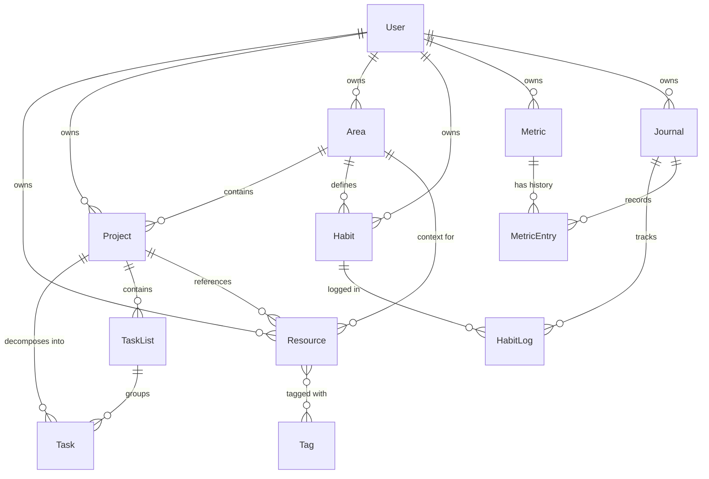

# Kernel Data Model

本文件定義 Kernel 系統中所有核心實體的資料模型 (Data Model)。
基於 PRD 1.3「核心概念與產品詞彙定義」所整理。

---

## 實體關係總覽 (ER Diagram)



---

## 1. User (使用者)

系統的核心身份實體，所有資料皆歸屬於特定使用者。

```typescript
interface User {
  id: UUID;                     // 主鍵
  email: string;                // 登入用電子郵件
  displayName: string;          // 顯示名稱
  avatarUrl?: URL;              // 頭像圖片連結
  plan: 'free' | 'pro';         // 方案類型
  createdAt: DateTime;
  updatedAt: DateTime;
}
```

---

## 2. Resource (資源)

用於表示一筆可被保存、引用與回溯的內容單位。

```typescript
interface Resource {
  id: UUID;                             // 主鍵
  userId: UUID;                         // 所屬使用者 (FK -> User)
  title: string;                        // 標題
  content: Markdown;                    // 資源內容 (富文本)
  sourceLink?: URL;                     // 參考連結 (若為 URL 類型)
  status: 'pending' | 'processed' | 'archived';  // 資源狀態
  linkedProjects: ProjectID[];          // 關聯專案 (多對多)
  linkedAreas: AreaID[];                // 關聯領域 (多對多)
  tags: TagID[];                        // 標籤 (多對多)
  isDeleted: boolean;                   // 軟刪除標記
  createdAt: DateTime;
  updatedAt: DateTime;
}
```

**狀態轉換規則：**
- `pending` → `processed` (建立關聯後自動觸發)
- `pending` → `archived` (直接封存)
- `processed` → `archived` (退出關注)
- `archived` → `processed` (重新啟用並建立關聯, 前提為必須有有效(active)之專案或領域)

---

## 3. Project (專案)

用於管理具備明確目標、可被完成之工作單位。

```typescript
interface Project {
  id: UUID;                             // 主鍵
  userId: UUID;                         // 所屬使用者 (FK -> User)
  name: string;                         // 專案名稱
  description?: string;                 // 專案摘要與說明
  areaId?: AreaID;                      // 隸屬領域 (FK -> Area, 非必要)
  status: 'active' | 'completed' | 'archived';  // 專案狀態
  dueDate?: Date;                       // 截止日期
  progress: number;                     // 進度 (0-100, 依任務完成情況計算)
  createdAt: DateTime;
  updatedAt: DateTime;
}
```

**狀態轉換規則：**
- `active` → `completed` (達成目標)
- `active` → `archived` (中止/擱置)
- `archived` → `active` (重啟專案)

---

## 4. TaskList (任務清單)

用於在專案中組織任務的分組容器。

```typescript
interface TaskList {
  id: UUID;                             // 主鍵
  projectId: ProjectID;                 // 所屬專案 (FK -> Project)
  name: string;                         // 清單名稱 (e.g., "To Do", "In Progress", "Done")
  order: number;                        // 排序順序
  createdAt: DateTime;
  updatedAt: DateTime;
}
```

---

## 5. Task (任務)

用於描述專案中可執行、可完成的具體行動單位。

```typescript
interface Task {
  id: UUID;                             // 主鍵
  projectId: ProjectID;                 // 所屬專案 (FK -> Project)
  taskListId?: TaskListID;              // 所屬任務清單 (FK -> TaskList, 可選)
  description: string;                  // 任務描述
  isCompleted: boolean;                 // 是否已完成
  order: number;                        // 排序順序
  createdAt: DateTime;
  updatedAt: DateTime;
}
```

---

## 6. Area (領域)

用於描述長期存在、無明確結束時間的人生責任範圍或生活面向。

```typescript
interface Area {
  id: UUID;                             // 主鍵
  userId: UUID;                         // 所屬使用者 (FK -> User)
  name: string;                         // 領域名稱
  description?: string;                 // 領域描述
  status: 'active' | 'hidden';          // 領域狀態
  order: number;                        // 排序順序
  createdAt: DateTime;
  updatedAt: DateTime;
}
```

**狀態說明：**
- `active`: 該領域仍屬於當前關注的人生版圖
- `hidden`: 該領域暫時退出關注視野，但不代表其重要性被否定

---

## 7. Habit (習慣)

用於描述為維持某一領域而需持續重複進行的行為承諾。

```typescript
interface Habit {
  id: UUID;                             // 主鍵
  userId: UUID;                         // 所屬使用者 (FK -> User)
  areaId: AreaID;                       // 隸屬領域 (FK -> Area)
  name: string;                         // 習慣名稱
  frequency: 'daily' | 'weekly';        // 頻率設定 (Daily 或 Weekly)
  weekDay?: number;                     // 僅 Weekly 需設定：1=週一 ... 7=週日
  isActive: boolean;                    // 是否啟用
  createdAt: DateTime;
  updatedAt: DateTime;
}
```

---

## 8. HabitLog (習慣紀錄)

記錄習慣在特定日期的執行情況。

```typescript
interface HabitLog {
  id: UUID;                             // 主鍵
  habitId: HabitID;                     // 所屬習慣 (FK -> Habit)
  journalId: JournalID;                 // 所屬日記 (FK -> Journal)
  date: Date;                           // 日期
  isCompleted: boolean;                 // 當日是否執行
}
```

---

## 9. Metric (指標)

由使用者定義的「需被長期觀察與量化的狀態」。

```typescript
interface Metric {
  id: UUID;                             // 主鍵
  userId: UUID;                         // 所屬使用者 (FK -> User)
  name: string;                         // 指標名稱
  unit?: string;                        // 單位 (僅用於 number 類型, e.g., kg, km)
  inputType: 'number' | 'rating' | 'select' | 'time' | 'sleep'; // 輸入類型 (sleep 為專屬睡眠模組)
  options?: string[];                   // 僅用於 select 類型 (選項清單)
  isSystem?: boolean;                   // 是否為系統預設指標 (系統指標不可刪除, 如睡眠追蹤)
  isActive: boolean;                    // 是否啟用
  createdAt: DateTime;
  updatedAt: DateTime;
}
```

---

## 10. MetricEntry (指標數據紀錄)

記錄指標在特定日期的量測數值。

```typescript
interface MetricEntry {
  id: UUID;                             // 主鍵
  metricId: UUID;                       // 所屬指標 (FK -> Metric)
  journalId: UUID;                      // 所屬日記 (FK -> Journal)
  date: Date;                           // 日期
  value: number | string;               // 儲存值
                                        // - number: 數值/評分
                                        // - string: 選項名稱 / 時間戳記 ("HH:mm")
                                        // - JSON string: 睡眠數據 (e.g., '{"sleepAt":"23:00","wakeUpAt":"07:00"}')
}
```

---

## 11. Journal (日記)

用於記錄每日狀態與觀察結果的時間型容器。

```typescript
interface Journal {
  id: UUID;                             // 主鍵
  userId: UUID;                         // 所屬使用者 (FK -> User)
  date: Date;                           // 日期 (唯一索引)
  dailyNote?: Markdown;                 // 當日文字記錄與摘要
  createdAt: DateTime;
  updatedAt: DateTime;
}
```

**聚合視圖說明：**
Journal 本身是時間索引，透過關聯可查詢：
- 當日習慣執行情況 (`HabitLog WHERE date = journal.date`)
- 當日指標數據 (`MetricEntry WHERE date = journal.date`)
- 當日進行中專案 (`Project WHERE status = 'active'`)
- 當日待處理資源 (`Resource WHERE status = 'pending'`)

---

## 12. Tag (標籤)

用於對資源進行彈性分類的標記。

```typescript
interface Tag {
  id: UUID;                             // 主鍵
  userId: UUID;                         // 所屬使用者 (FK -> User)
  name: string;                         // 標籤名稱
  color?: string;                       // 標籤顏色 (Hex)
  createdAt: DateTime;
}
```

---

## 聚合視圖定義 (Aggregated Views)

以下為非實體儲存的邏輯視圖：

| 視圖名稱 | 說明 | 查詢邏輯 |
|---------|------|---------|
| **Inbox** | 尚未完成決策的資源暫存視圖 | `Resource WHERE status = 'pending' AND isDeleted = false` |
| **Resource Library** | 已完成決策的資源查詢空間 | `Resource WHERE status IN ('processed', 'archived') AND isDeleted = false` |

---

## 類型定義參考

```typescript
type UUID = string;
type URL = string;
type Markdown = string;
type DateTime = string; // ISO 8601 format
type Date = string;     // YYYY-MM-DD format

type ProjectID = UUID;
type AreaID = UUID;
type TagID = UUID;
type TaskListID = UUID;
type HabitID = UUID;
type MetricID = UUID;
type JournalID = UUID;
```

---

## 13. WorkbenchItem (工作台項目)

用於記錄使用者在 Workbench 中「Doing」與「Todo」區塊的自定義排序與焦點狀態。

*   **Todo 區塊邏輯**：採「混合排序」機制。
    *   **置頂排序區 (Pinned)**：存在於 `WorkbenchItem (section='todo')` 的任務，依 `order` 排序。
    *   **一般區 (Default)**：其餘 Active Project Tasks，依 `dueDate` 或 `createdAt` 排序，接續在置頂區之後。

```typescript
interface WorkbenchItem {
  id: UUID;                     // 主鍵
  userId: UUID;                 // 所屬使用者 (FK -> User)
  taskId: UUID;                 // 關聯的任務 (FK -> Task)
  section: 'doing' | 'todo';    // 所在區塊 (Doing / Todo)
  order: number;                // 在該區塊中的排序
  addedAt: DateTime;            // 加入時間
}
```

