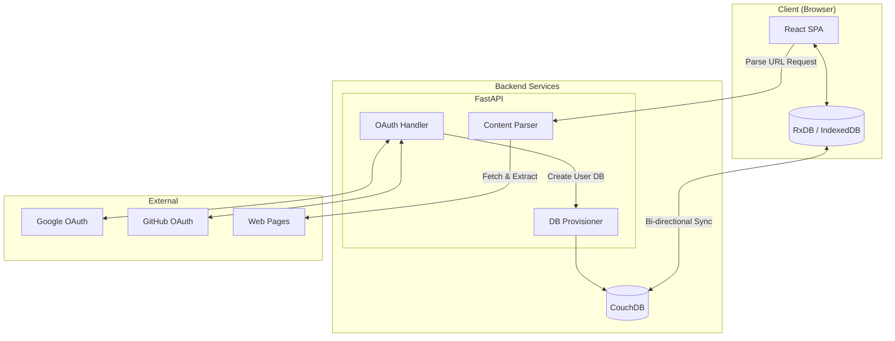
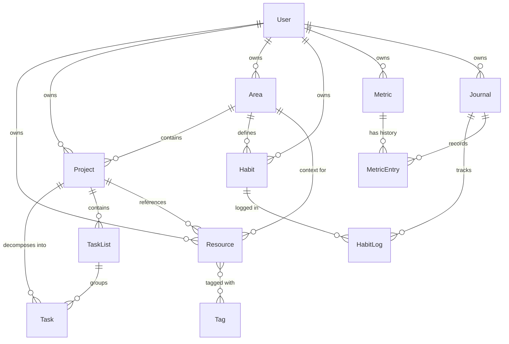
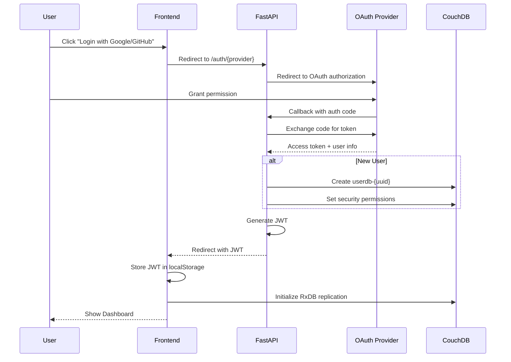
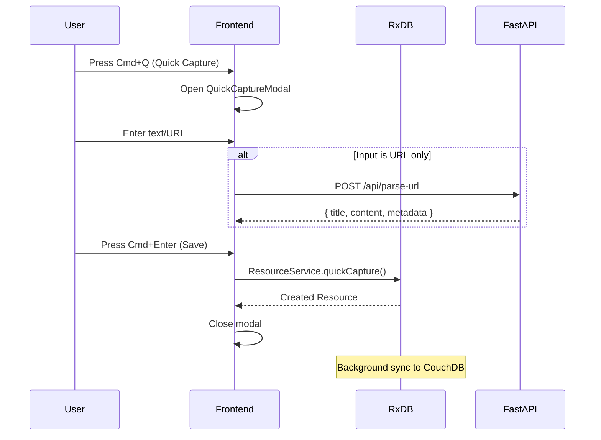
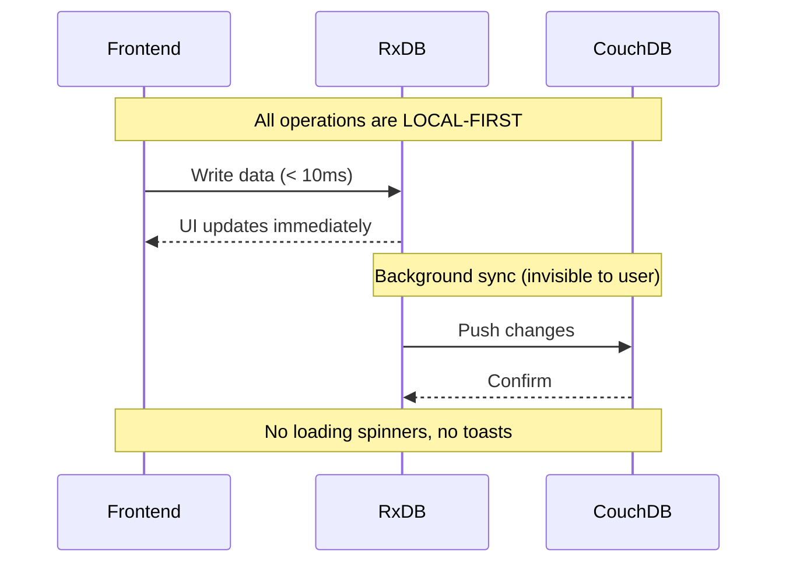

# Kernel Architecture Document

**Version**: 1.0
**Status**: Approved
**Last Updated**: 2026-01-12

---

## 1. Introduction

本文件概述 Kernel 專案的整體系統架構，包含後端服務、共享元件以及非 UI 相關的技術考量。主要目標是作為 AI 輔助開發的架構藍圖，確保開發過程中遵循既定的模式與技術選型。

**與前端架構的關係：**
本專案包含顯著的使用者介面元件，前端特定的設計細節將記錄於本文件的 UI/UX 相關章節。核心技術棧選擇（見「Tech Stack」章節）為整個專案的權威定義。

### 1.1 Starter Template

**Starter Template: Vite React TypeScript**

本專案使用 Vite 官方提供的 React + TypeScript 模板作為起始點：

```bash
npm create vite@latest kernel -- --template react-ts
```

**選擇理由：**
- 極速的 HMR (Hot Module Replacement) 開發體驗
- 原生 TypeScript 支援，無需額外配置
- 輕量且現代化的建構工具
- 符合 PRD 技術棧要求

### 1.2 Change Log

| Date | Version | Description | Author |
|------|---------|-------------|--------|
| 2026-01-12 | 1.0 | Initial architecture document | BMad Master |

---

## 2. High Level Architecture

### 2.1 Technical Summary

Kernel 採用 **Local-First SPA 架構**，以 React 為前端框架，搭配 RxDB 作為本地響應式資料庫，實現離線優先的使用者體驗。後端採用輕量級微服務設計，由 CouchDB 負責多裝置同步，FastAPI 處理身分驗證與內容解析。

此架構的核心理念是「**資料在用戶端，同步在背景**」，確保即使在無網路環境下，使用者仍能完整操作所有功能。

### 2.2 High Level Overview

| 項目 | 決策 |
|------|------|
| **架構風格** | Local-First SPA + Optional Sync Backend |
| **Repository 結構** | Monorepo (前端 + 後端服務) |
| **服務架構** | 輕量微服務 (Auth Service + Content Parser) |
| **主要資料流** | Client-side CRUD → RxDB → Background Sync → CouchDB |

### 2.3 High Level Project Diagram



### 2.4 Architectural Patterns

| 模式 | 說明 | 理由 |
|------|------|------|
| **Local-First Architecture** | 資料優先存於本地，背景同步至雲端 | PRD 核心需求：離線操作、低延遲 |
| **Reactive Data Binding** | RxDB Query Streams 直接綁定 React UI | 資料變更即時反映，無需手動刷新 |
| **Repository Pattern** | Service Layer 封裝資料存取邏輯 | 便於測試與維護 |
| **Event-Driven Sync** | CouchDB 變更事件驅動雙向同步 | 自動衝突解決，多裝置一致性 |
| **API Gateway Pattern** | FastAPI 作為後端單一入口 | 統一處理 Auth、Rate Limiting、CORS |

---

## 3. Tech Stack

> ⚠️ 此章節是整個專案的**技術選型權威定義**。所有開發決策必須參照此表。

### 3.1 Cloud Infrastructure

- **Provider:** Self-hosted / Docker (開發階段) → Fly.io (生產階段)
- **Key Services:** CouchDB Container, FastAPI Container
- **Frontend Hosting:** Vercel

### 3.2 Technology Stack Table

#### Frontend Layer

| Category | Technology | Version | Purpose | Rationale |
|----------|------------|---------|---------|-----------|
| **Language** | TypeScript | 5.3.x | 主要開發語言 | 強型別確保資料模型安全 |
| **Runtime** | Node.js | 20.x LTS | 開發環境運行時 | 長期支援版本 |
| **Build Tool** | Vite | 5.4.x | 建構與開發伺服器 | 極速 HMR |
| **Framework** | React | 18.3.x | UI 框架 | Functional Components + Hooks |
| **Routing** | React Router | 6.x | SPA 路由 | 業界標準 |
| **UI State** | Zustand | 4.x | 非持久化 UI 狀態 | 輕量、簡潔 |

#### UI/UX Layer

| Category | Technology | Version | Purpose | Rationale |
|----------|------------|---------|---------|-----------|
| **Styling** | TailwindCSS | 3.4.x | Utility-first CSS | CSS Variables 動態主題 |
| **Components** | shadcn/ui | latest | 無頭組件庫 | 基於 Radix UI，A11y 完善 |
| **Charts** | Recharts | 2.x | 資料視覺化 | React 原生設計 |
| **Animation** | Framer Motion | 11.x | 微交互動畫 | 提升操作觸感 |
| **Rich Editor** | TipTap | 2.x | 富文本編輯器 | ProseMirror 核心，擴展豐富 |
| **Drag & Drop** | dnd-kit | 6.x | 拖曳功能 | 現代化、無障礙 |
| **Icons** | Lucide React | 0.400.x | 圖示庫 | 風格統一 |
| **Date Utils** | date-fns | 3.x | 日期處理 | 輕量 |
| **Fonts** | @fontsource | - | 自託管字型 | Newsreader, Inter |
| **Hooks** | usehooks-ts | 3.x | 實用 Hooks | useDarkMode 等 |

#### Data Layer

| Category | Technology | Version | Purpose | Rationale |
|----------|------------|---------|---------|-----------|
| **Local DB** | RxDB | 15.x | 響應式本地資料庫 | 即時查詢流，Local-first 核心 |
| **Storage** | Dexie.js | 4.x | IndexedDB 適配器 | 高效能瀏覽器儲存 |
| **Encryption** | RxDB Encryption | 15.x | 本地資料加密 | AES-256 |
| **Remote Sync** | CouchDB | 3.3.x | 多裝置同步節點 | Master-Master Replication |

#### Backend Layer

| Category | Technology | Version | Purpose | Rationale |
|----------|------------|---------|---------|-----------|
| **Framework** | FastAPI | 0.110.x | Python 後端框架 | 高效能、自動 API 文件 |
| **Python** | Python | 3.12.x | 後端語言 | 最新穩定版 |
| **Content Parser** | Trafilatura | 1.x | 網頁內容提取 | 專業文章提取 |
| **HTML Parser** | BeautifulSoup4 | 4.x | HTML/OG 解析 | 預覽卡片資料來源 |
| **Container** | Docker | 24.x | 容器化部署 | 環境一致性 |

#### Testing Layer

| Category | Technology | Version | Purpose | Rationale |
|----------|------------|---------|---------|-----------|
| **Unit Test** | Vitest | 1.x | 單元/整合測試 | 與 Vite 設定共用 |
| **Component Test** | React Testing Library | 14.x | 組件測試 | 驗證渲染與互動 |
| **E2E Test** | Playwright | 1.44.x | 端對端測試 | 跨瀏覽器 |

---

## 4. Data Models

> 📄 **詳細定義參考**: `doc/2.1.dataModel.md`

### 4.1 Entity Relationship Diagram



### 4.2 Entity Summary

| Entity | Purpose | Key States |
|--------|---------|------------|
| **User** | 系統核心身份實體 | plan: free/pro/founder |
| **Resource** | 可保存、引用的內容單位 | pending → processed → archived |
| **Project** | 具明確目標的工作單位 | active → completed/archived |
| **Task** | 專案內可執行的行動單位 | isCompleted: boolean |
| **Area** | 長期責任範圍/生活面向 | active / hidden |
| **Habit** | 持續重複的行為承諾 | isActive: boolean |
| **Journal** | 每日狀態與觀察容器 | 依日期唯一索引 |
| **Metric** | 需長期觀察的量化指標 | inputType: number/rating/select/time/sleep |

### 4.3 Aggregated Views

| View | Definition | Query Logic |
|------|------------|-------------|
| **Inbox** | 待處理資源暫存視圖 | `Resource WHERE status = 'pending'` |
| **Resource Library** | 已處理資源查詢空間 | `Resource WHERE status IN ('processed', 'archived')` |

---

## 5. Components

### 5.1 Frontend Components

#### Layout Components

| Component | Responsibility |
|-----------|---------------|
| **AppLayout** | 全站佈局容器 (Sidebar + TopBar + MainContent) |
| **Sidebar** | 左側導航欄 |
| **TopBar** | 頂部工具列 (Global Search) |

#### Page Components

| Component | Route |
|-----------|-------|
| **DashboardPage** | `/` |
| **InboxPage** | `/inbox` |
| **ResourceEditorPage** | `/inbox/:id`, `/resources/:id` |
| **ProjectListPage** | `/projects` |
| **ProjectDetailPage** | `/projects/:id` |
| **AreaListPage** | `/areas` |
| **AreaDetailPage** | `/areas/:id` |
| **ResourceLibraryPage** | `/resources` |
| **JournalPage** | `/journal`, `/journal/:date` |
| **MetricsPage** | `/metrics` |
| **SettingsPage** | `/settings` |
| **LoginPage** | `/login` |

### 5.2 Service Layer

| Service | Key Operations |
|---------|----------------|
| **ResourceService** | `quickCapture`, `getPendingList`, `update`, `search`, `delete` |
| **ProjectService** | `getList`, `getWorkbench`, `getDetail`, `create`, `update`, `delete` |
| **TaskService** | `create`, `update`, `delete` |
| **AreaService** | `getList`, `getDetail`, `create`, `update`, `delete` |
| **HabitService** | `create`, `update`, `toggleLog`, `delete` |
| **JournalService** | `getDailyView`, `updateNote` |
| **MetricService** | `create`, `update`, `recordEntry`, `delete` |
| **UserService** | `getSettings`, `updateSettings` |

### 5.3 Backend Components (FastAPI)

| Component | Endpoints |
|-----------|-----------|
| **AuthService** | `/auth/google`, `/auth/github`, `/auth/callback` |
| **DBProvisioner** | Internal (creates `userdb-{uuid}`) |
| **ContentParser** | `/api/parse-url` |

---

## 6. External APIs

### 6.1 Google OAuth 2.0 API

| 項目 | 說明 |
|------|------|
| **Purpose** | 使用者透過 Google 帳號登入 |
| **Documentation** | https://developers.google.com/identity/protocols/oauth2 |
| **Scopes** | `openid`, `email`, `profile` |

### 6.2 GitHub OAuth API

| 項目 | 說明 |
|------|------|
| **Purpose** | 使用者透過 GitHub 帳號登入 |
| **Documentation** | https://docs.github.com/en/developers/apps/building-oauth-apps |
| **Scopes** | `read:user`, `user:email` |

### 6.3 CouchDB HTTP API

| 項目 | 說明 |
|------|------|
| **Purpose** | 多裝置資料同步節點 |
| **Documentation** | https://docs.couchdb.org/en/stable/api/index.html |
| **Authentication** | Session Auth / JWT |

---

## 7. Core Workflows

### 7.1 User Authentication Flow



### 7.2 Quick Capture Flow



### 7.3 Data Sync Flow (Notion-like 無感同步)



---

## 8. Database Schema (RxDB)

### 8.1 Schema Overview

| Collection | Primary Key | Encrypted Fields |
|------------|-------------|------------------|
| `resources` | `id` | `content` |
| `projects` | `id` | - |
| `tasks` | `id` | - |
| `areas` | `id` | - |
| `habits` | `id` | - |
| `journals` | `id` | `dailyNote` |
| `metrics` | `id` | - |

### 8.2 Example Schema (Resource)

```typescript
const resourceSchema: RxJsonSchema<Resource> = {
  version: 0,
  primaryKey: 'id',
  type: 'object',
  properties: {
    id: { type: 'string', maxLength: 36 },
    userId: { type: 'string', maxLength: 36 },
    title: { type: 'string' },
    content: { type: 'string' },
    sourceLink: { type: 'string' },
    status: { type: 'string', enum: ['pending', 'processed', 'archived'] },
    linkedProjects: { type: 'array', items: { type: 'string' } },
    linkedAreas: { type: 'array', items: { type: 'string' } },
    tags: { type: 'array', items: { type: 'string' } },
    isDeleted: { type: 'boolean', default: false },
    createdAt: { type: 'string', format: 'date-time' },
    updatedAt: { type: 'string', format: 'date-time' }
  },
  required: ['id', 'userId', 'title', 'status', 'createdAt', 'updatedAt'],
  indexes: ['status', 'createdAt', ['userId', 'status']]
};
```

---

## 9. Source Tree

```
kernel/
├── frontend/
│   ├── src/
│   │   ├── components/
│   │   │   ├── ui/                 # shadcn/ui components
│   │   │   ├── layout/             # AppLayout, Sidebar, TopBar
│   │   │   ├── editor/             # TipTap editor
│   │   │   ├── modals/             # QuickCaptureModal, etc.
│   │   │   └── shared/             # EmptyState, LoadingSpinner
│   │   ├── pages/                  # Page components
│   │   ├── services/               # Service Layer
│   │   ├── schemas/                # RxDB Schemas
│   │   ├── hooks/                  # Custom Hooks
│   │   ├── stores/                 # Zustand Stores
│   │   ├── lib/                    # Utilities
│   │   ├── types/                  # TypeScript types
│   │   └── styles/                 # Global CSS
│   ├── tests/
│   ├── package.json
│   └── vite.config.ts
├── backend/
│   ├── app/
│   │   ├── api/v1/                 # API Routes
│   │   ├── core/                   # Config, Security
│   │   ├── services/               # Business Logic
│   │   └── models/                 # Pydantic Models
│   ├── tests/
│   ├── requirements.txt
│   └── Dockerfile
├── docs/
│   ├── architecture.md             # This file
│   └── stories/                    # User Stories
├── docker/
│   └── couchdb/
├── docker-compose.yml
└── README.md
```

---

## 10. Infrastructure & Deployment

### 10.1 Deployment Strategy

| Component | Platform | Control Method |
|-----------|----------|----------------|
| **Frontend** | Vercel | `vercel` CLI |
| **Backend** | Fly.io | `flyctl` CLI |
| **CouchDB** | Fly.io (Volume) | `flyctl` CLI |

### 10.2 Environment Variables

```bash
# Frontend (.env)
VITE_API_URL=http://localhost:8000
VITE_COUCHDB_URL=http://localhost:5984

# Backend (.env)
COUCHDB_URL=http://localhost:5984
COUCHDB_USER=admin
COUCHDB_PASSWORD=password
GOOGLE_CLIENT_ID=xxx
GOOGLE_CLIENT_SECRET=xxx
GITHUB_CLIENT_ID=xxx
GITHUB_CLIENT_SECRET=xxx
JWT_SECRET=xxx
```

### 10.3 CI/CD Pipeline

```yaml
# .github/workflows/ci.yml
on:
  push:
    branches: [main, develop]

jobs:
  frontend:
    runs-on: ubuntu-latest
    steps:
      - run: npm ci
      - run: npm run lint
      - run: npm run test
      - run: npm run build

  backend:
    runs-on: ubuntu-latest
    steps:
      - run: pip install -r requirements.txt
      - run: pytest

  deploy:
    needs: [frontend, backend]
    if: github.ref == 'refs/heads/main'
    steps:
      - run: vercel deploy --prod
      - run: flyctl deploy
```

---

## 11. Error Handling (Notion-like 無感體驗)

### 11.1 Core Principles

| Principle | Implementation |
|-----------|----------------|
| **所有操作即時生效** | RxDB 本地寫入 < 10ms |
| **同步是隱形的** | 背景進行，無 UI 回饋 |
| **離線是自然的** | 不顯示「離線模式」Banner |
| **錯誤是罕見的** | 只有本地 DB 失敗才顯示 |

### 11.2 Error Levels

| Level | Error Type | User Perception | Handling |
|-------|------------|-----------------|----------|
| 0 | 本地寫入成功 | 無感 | 正常流程 |
| 1 | 單次同步失敗 | 無感 | 靜默重試 |
| 2 | 連續 3 次失敗 | 小灰點 | Sidebar 狀態點 |
| 3 | 離線 > 5 分鐘 | Tooltip | Hover 顯示 |
| 4 | 本地寫入失敗 | Toast | 唯一顯示錯誤 |

### 11.3 禁止事項

- ❌ 禁止顯示 Loading Spinner
- ❌ 禁止顯示「同步中」Toast
- ❌ 禁止顯示「已儲存」Toast
- ❌ 禁止顯示「離線模式」Banner

---

## 12. Coding Standards

### 12.1 Critical Rules (AI 必須遵守)

| Rule | Description |
|------|-------------|
| ❌ 禁止 `console.log` | 使用 `console.error` 或 `console.warn` |
| ❌ 禁止 `any` 型別 | 必須定義明確型別 |
| ❌ 禁止直接操作 RxDB | 必須透過 Service Layer |
| ✅ 使用 Path Alias | `@/components`, `@/lib` |
| ✅ 使用 Functional Components | 不使用 Class Components |
| ✅ 使用 shadcn/ui 組件 | 優先使用現有組件 |
| ✅ 使用 TailwindCSS | 不寫自定義 CSS |

### 12.2 Naming Conventions

| Element | Convention | Example |
|---------|------------|---------|
| Components | PascalCase | `QuickCaptureModal.tsx` |
| Hooks | camelCase, `use` prefix | `useDatabase.ts` |
| Services | PascalCase, `Service` suffix | `ResourceService.ts` |
| Constants | UPPER_SNAKE_CASE | `MAX_RETRY_COUNT` |

---

## 13. Test Strategy

### 13.1 Overview

| Item | Value |
|------|-------|
| **Approach** | Test-After |
| **Coverage Goals** | 70% (Services), 50% (Components) |
| **Test Pyramid** | Unit (60%) → Integration (30%) → E2E (10%) |

### 13.2 Test Types

| Type | Framework | Location |
|------|-----------|----------|
| Unit | Vitest | `tests/unit/` |
| Integration | Vitest + RxDB (memory) | `tests/integration/` |
| Component | React Testing Library | `tests/components/` |
| E2E | Playwright | `tests/e2e/` |

---

## 14. Security

### 14.1 Authentication

| Item | Implementation |
|------|----------------|
| **Method** | OAuth 2.0 (Google, GitHub) + JWT |
| **Storage** | JWT in localStorage |
| **Expiry** | 7 days |

### 14.2 Data Protection

| Item | Implementation |
|------|----------------|
| **Encryption at Rest** | RxDB Encryption (AES-256) |
| **Encryption in Transit** | HTTPS/TLS 1.3 |
| **Encrypted Fields** | `content`, `dailyNote` |

### 14.3 CouchDB Security

```javascript
// Each user has isolated database: userdb-{uuid}
{
  "admins": { "names": [], "roles": ["_admin"] },
  "members": { "names": ["user-uuid"], "roles": [] }
}
```

### 14.4 Security Checklist (AI 必須遵守)

- ❌ 禁止 hardcode 任何 secrets
- ❌ 禁止 console.log 敏感資料
- ❌ 禁止信任用戶輸入 (必須驗證)
- ✅ 所有 API 必須驗證 JWT
- ✅ 所有用戶輸入必須用 Zod 驗證
- ✅ 敏感欄位必須加密儲存

---

## Next Steps

1. **開始開發**：依照 `doc/Implementation_task.md` 執行 Phase 1
2. **建立 Stories**：使用 BMad `*task create-next-story` 建立開發故事
3. **環境設置**：設定 Google/GitHub OAuth 應用程式
